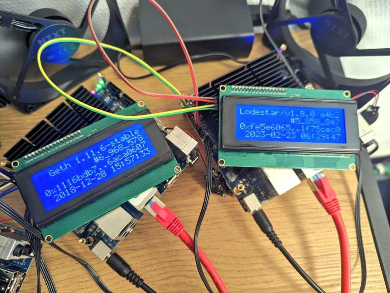

# i2c-lcd-ethereum
iic bus scripts for monitoring ethereum nodes using serial lcd displays (here: `20x4`)

[](.github/screenshot.png)

## setup

* requires `python3`
* requires `smbus2` and `web3`

```bash
pip3 install smbus2 web3
```

i2c lcd drivers are provided in `./i2c`

## i2c lcd connection

asusming you are on linux:
* connect your i2c lcd display as per spec.
* install `i2c-tools` system package.
* add/load the `i2c-dev` kernel module.

identify your i2c lcd adapter _bus_ (here `11` or `12`):

```bash
i2cdetect -l
i2c-0  i2c         i915 gmbus dpa                    I2C adapter
i2c-1  i2c         i915 gmbus dpb                    I2C adapter
i2c-2  i2c         i915 gmbus dpc                    I2C adapter
i2c-3  i2c         i915 gmbus tc1                    I2C adapter
i2c-4  i2c         i915 gmbus tc2                    I2C adapter
i2c-5  i2c         i915 gmbus tc3                    I2C adapter
i2c-6  i2c         i915 gmbus tc4                    I2C adapter
i2c-7  i2c         i915 gmbus tc5                    I2C adapter
i2c-8  i2c         i915 gmbus tc6                    I2C adapter
i2c-9  i2c         AUX B/DDI B/PHY B                 I2C adapter
i2c-10 smbus       SMBus I801 adapter at efa0        SMBus adapter
i2c-11 i2c         Synopsys DesignWare I2C adapter   I2C adapter
i2c-12 i2c         Synopsys DesignWare I2C adapter   I2C adapter
```

get your display's _address_ (here `0x27`):

```bash
i2cdetect -y -r 11
     0  1  2  3  4  5  6  7  8  9  a  b  c  d  e  f
00:                         -- -- -- -- -- -- -- --
10: -- -- -- -- -- -- -- -- -- -- -- -- -- -- -- --
20: -- -- -- -- -- -- -- 27 -- -- -- -- -- -- -- --
30: -- -- -- -- -- -- -- -- -- -- -- -- -- -- -- --
40: -- -- -- -- -- -- -- -- -- -- -- -- -- -- -- --
50: -- -- -- -- -- -- -- -- -- -- -- -- -- -- -- --
60: -- -- -- -- -- -- -- -- -- -- -- -- -- -- -- --
70: -- -- -- -- -- -- -- --
```

add these values to your script:

```python
bus = 2
address = 0x27
lcd = lcd.display(address, bus)
```

see [demo.py](./demo.py) to get started.

## credits

license: `gplv3`

drivers adapted from:
* https://github.com/sweetpi/python-i2c-lcd
* https://github.com/hardkernel/i2c_20x4_lcd
